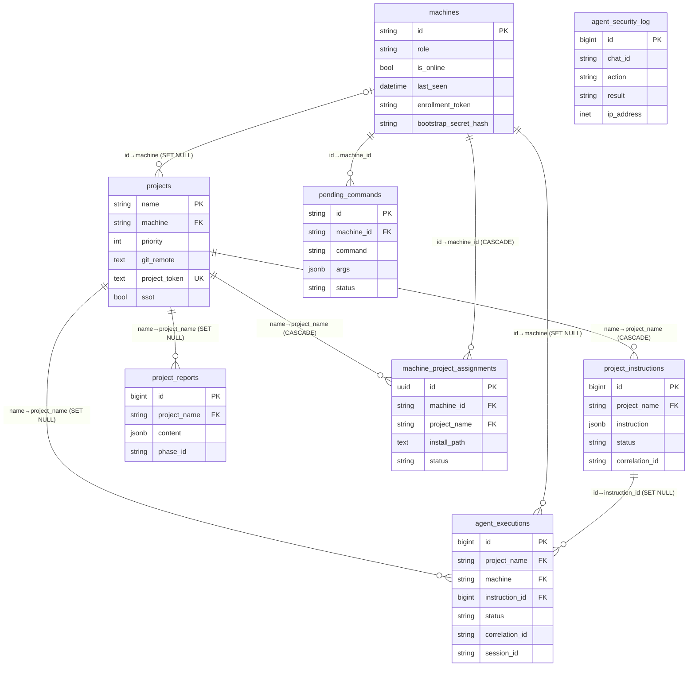
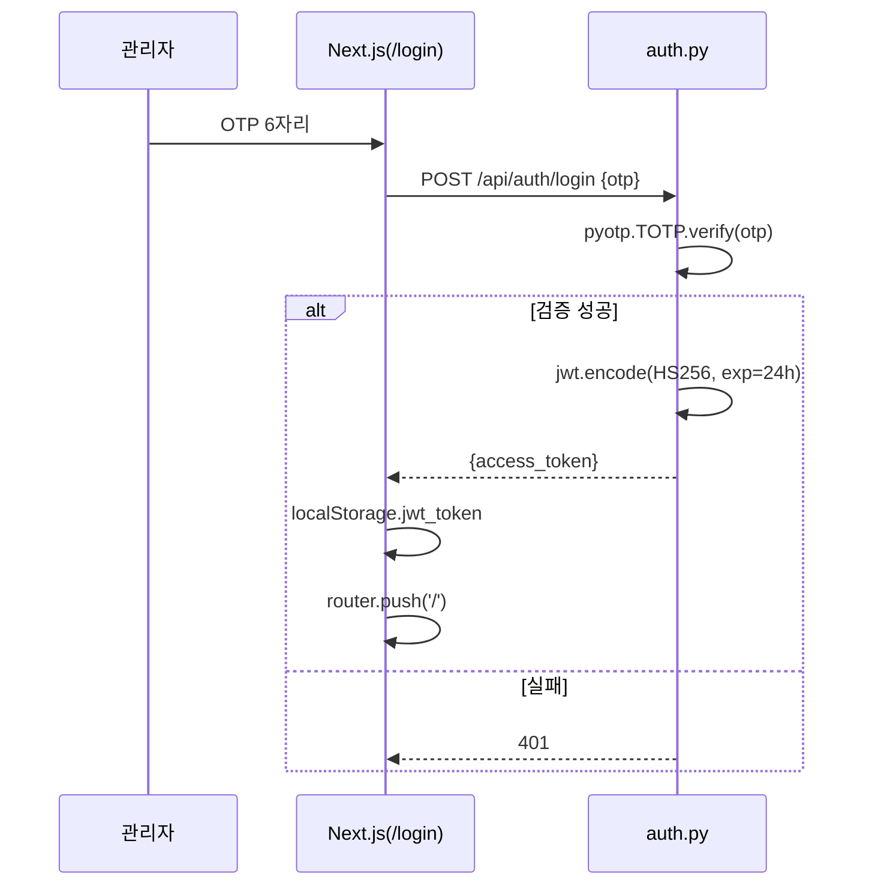
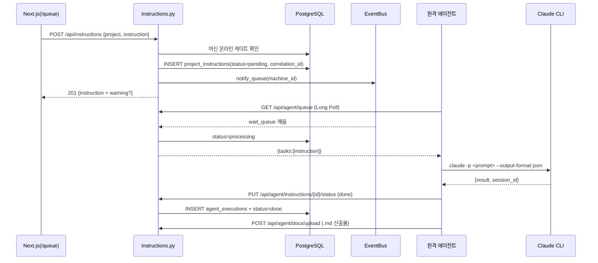
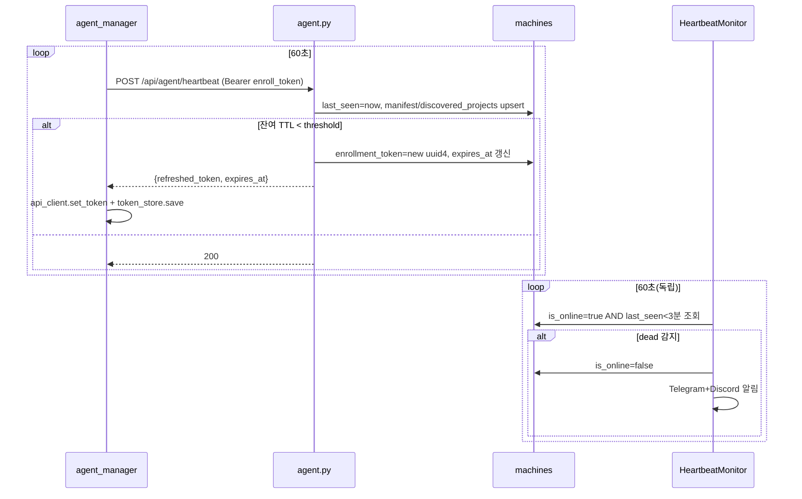
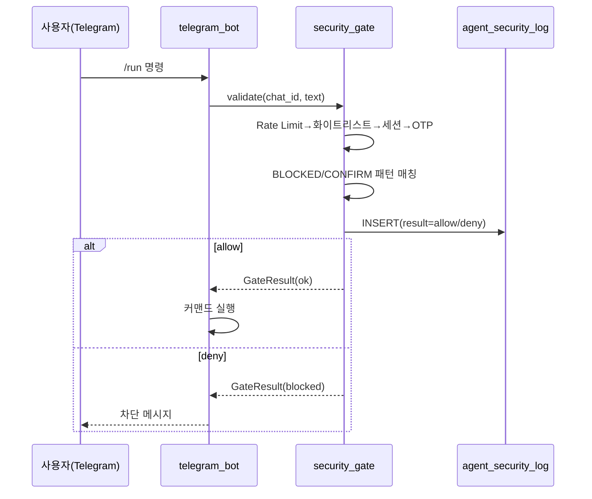
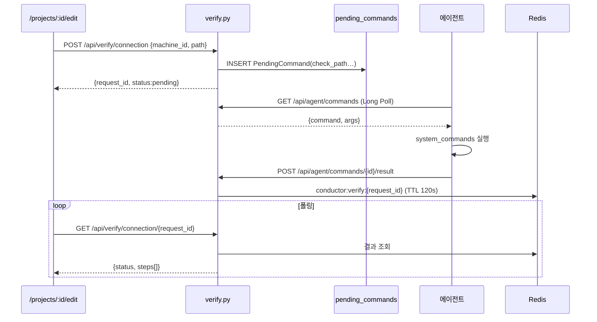

> ⚠️ 변경 금지 — 원본 immutable 보존 (Karpathy sources 계층)

# 03. 구현 기능 전수 (§5)

> [← README](./README.md)

## 목차
- [5-1. 기능 모듈표 (23)](#5-1-기능-모듈표-23)
- [5-2. DB 엔티티-테이블 매핑 (8 모델)](#5-2-db-엔티티-테이블-매핑-8-모델)
- [5-3. ER 다이어그램](#5-3-er-다이어그램)
- [5-4. 기능 시퀀스 다이어그램](#5-4-기능-시퀀스-다이어그램)

---

## 5-1. 기능 모듈표 (23)

`src/services` 16 + `src/reporters` 3 + 핵심 4. 진입점·의존·외부연동·데이터 흐름.

| 기능 | 핵심 파일 | 진입점 | 내부 의존 | 외부 연동 | 데이터 흐름 |
|---|---|---|---|---|---|
| 에이전트 매니저 | `services/agent_manager.py:35` | `AgentManager.start` | heartbeat_monitor, agent_listener(subprocess) | DB, subprocess | DB 프로젝트 로드→listener spawn→30초 동기화→60초 heartbeat |
| 에이전트 리스너(서버) | `agent_listener.py:31` | `AgentListener.start` | claude_executor, telegram/discord, report_receiver | Redis pub/sub, DB, Telegram, Discord | Redis 구독→Claude 실행→DB INSERT→Telegram+Discord 보고 |
| 오케스트레이터 | `services/orchestrator.py:26` | `process_queue`/`enqueue`/`publish_one` | event_bus | DB | pending 조회→온라인 확인→EventBus 발행→processing 갱신 |
| 이벤트 버스 | `services/event_bus.py:9` | `notify_queue`/`wait_queue`/`notify_command`/`wait_command` | - | 없음(인메모리) | notify(Event.set)→wait(timeout 대기)→반환 |
| Claude 실행기(서버) | `claude_executor.py:34` | `ClaudeExecutor.execute` | runtime_config | claude CLI(subprocess) | prompt→`claude -p --output-format json`→JSON 파싱→ExecutionResult |
| 보안 게이트 | `security_gate.py:171` | `SecurityGate.validate` | runtime_config | DB, pyotp | Rate Limit→화이트리스트→세션→OTP→패턴 매칭→로그 INSERT |
| Redis 큐 핸들러 | `queue_handler.py:22` | `main()` | agent_listener | Redis(BRPOP via worker.sh) | BRPOP→stdin JSON→handle_instruction→종료 |
| 텔레그램 봇 | `services/telegram_bot.py:51` | `TelegramBot.run` | security_gate, telegram_commands | Telegram(polling) | run_polling→_dispatch→SecurityGate→커맨드 핸들러 |
| 텔레그램 커맨드 | `services/telegram_commands.py:28` | `handle_command` | orchestrator, heartbeat_monitor, project_service | DB, httpx | 커맨드 파싱→/run POST→/status DB 집계→텍스트 응답 |
| 하트비트 모니터 | `services/heartbeat_monitor.py:27` | `start`/`_check_loop` | telegram/discord | DB, Telegram, Discord | 60초→dead(3분) 감지→is_online=false→알림→만료 명령 정리 |
| Discord 알림 | `services/discord_notifier.py:62` | `send_event`/`send_alert`/… | - | Discord Webhook(3채널), Redis ZSet | Embed→httpx POST(백오프 3회)→Redis ZADD 이력 |
| 이메일 보고 | `services/email_reporter.py:21` | `send_result` | - | Gmail SMTP | `.md`→MIME 빌드→starttls+login→send_message |
| 메트릭 수집기 | `services/metrics_collector.py:68` | `collect_daily/weekly/security_metrics` | - | DB | 기간 설정→DB 집계→Pydantic 반환 |
| 메트릭 러너 | `services/metrics_runner.py:24` | `MetricsRunner.start` | metrics_collector, summary_reporter | - | 60초→일간(00:00)/주간(월 00:00) 미발송 시 요약 실행 |
| 요약 보고 | `services/summary_reporter.py:27` | `send_error_alert`/`generate_*_summary` | telegram/discord, metrics_collector | DB, Telegram, Discord | DB 집계→일간/주간 텍스트→병렬 발송 |
| 큐 잔류 감시 | `services/queue_monitor.py:35` | `start`/`_check_stale_instructions` | telegram/discord | DB, Telegram, Discord | 5분→processing 30분↑ 경고→60분↑ failed 전환 |
| 프로젝트 서비스 | `services/project_service.py` | `get_all_projects`/`generate_project_token` | - | DB, JSON fallback | DB 조회(실패 시 JSON)→ORM / `pp_`+token_urlsafe(32) |
| 시스템 명령 처리기 | `services/system_commands.py:157` | `handle_system_command` | - | OS subprocess | command 분기(ping/check_path/git_clone…)→결과 dict |
| 설치 스크립트 생성기 | `services/install_script.py:14` | `generate_install_script`/… | - | 없음(템플릿) | machine_id+url+token→bash 템플릿→install.sh+.env+README |
| 지시 발행 래퍼 | `reporters/instruction_publisher.py:66` | `publish_pending`/`publish_one` | orchestrator | DB | Orchestrator 위임(호환 래퍼) |
| 보고 수신기 | `reporters/report_receiver.py:53` | `receive_report`/`receive_from_text` | project_service | DB | ReportMessage→프로젝트 검증→ProjectReport INSERT |
| 텔레그램 보고 발송기 | `reporters/telegram_reporter.py:47` | `send_report`/`send_text` | - | Telegram | format→4096자 분할→send_message(백오프 3회) |
| (인프라) DB 세션 | `models/database.py` | async sessionmaker | - | PostgreSQL | asyncpg async engine + session 제공 |

> **[발견]** `HeartbeatMonitor.send_heartbeat`/`check_nodes`는 `telegram_commands`/`agent_manager`에서 호출되나 `heartbeat_monitor.py`에 미구현(stub)으로 보임. 에이전트 heartbeat는 HTTP `POST /api/agent/heartbeat`로 처리되고, `HeartbeatMonitor`는 수신측 dead-node 감시만 담당. → §05 진단 참조.

---

## 5-2. DB 엔티티-테이블 매핑 (8 모델)

`src/models/models.py`의 SQLAlchemy 모델 전수.

| 엔티티(클래스) | 테이블 | PK | 주요 컬럼·FK | 근거 |
|---|---|---|---|---|
| `Project` | `projects` | `name` | machine→machines.id(SET NULL), priority(1~10), git_url/branch/remote, project_token(UNIQUE), discord_channel, ssot | `models.py:234` |
| `Machine` | `machines` | `id` | role(worker/monitor), is_online, last_seen, enrollment_token(+expires_at), bootstrap_secret_hash, agent_version, base_path, install_dir | `models.py:364` |
| `ProjectInstruction` | `project_instructions` | `id`(BigInt) | project_name→projects.name(CASCADE), instruction(JSONB), priority, status(7종 CHECK), correlation_id | `models.py:71` |
| `AgentExecution` | `agent_executions` | `id`(BigInt) | project_name(SET NULL), machine→machines.id(SET NULL), status(running/success/failed/timeout), session_id, correlation_id, instruction_id→project_instructions.id | `models.py:129` |
| `ProjectReport` | `project_reports` | `id`(BigInt) | project_name→projects.name(SET NULL), machine, report_type, content(JSONB), phase_id, telegram_msg_id | `models.py:48` |
| `AgentSecurityLog` | `agent_security_log` | `id`(BigInt) | chat_id, action, result(allow/deny/error CHECK), detail(JSONB), ip_address(INET) | `models.py:105` |
| `PendingCommand` | `pending_commands` | `id`(UUID str) | machine_id→machines.id, command, args(JSONB), status(pending/sent/completed/failed/expired), result(JSONB), expires_at | `models.py:444` |
| `MachineProjectAssignment` | `machine_project_assignments` | `id`(UUID) | machine_id→machines.id(CASCADE), project_name→projects.name(CASCADE), install_path, status(pending/active/rejected), UNIQUE(machine_id,install_path) | `models.py:488` |

> Nexus 프로젝트(`/api/nexus/*`)는 별도 DB(`asyncpg` 직접 연결, `nexus.py:32`)로 SQLAlchemy 모델 외부. 마이그레이션 9종(`schema/migrations/001~009`)이 위 스키마를 점진 구성.

---

## 5-3. ER 다이어그램

---

## 5-4. 기능 시퀀스 다이어그램

### (1) 인증 (OTP→JWT)

### (2) Execution 생성 (지시→실행→보고)

### (3) 에이전트 heartbeat + 슬라이딩 토큰 회전

### (4) Security Gate (Telegram 명령 검증)

### (5) 머신 연결 검증 (PendingCommand 폴링)

