> ⚠️ 변경 금지 — 원본 immutable 보존 (Karpathy sources 계층). 출처: PAB-v4 리포 `docs/overview/260629-PAB-v4-khala연동-아키텍처분석.md`

# PAB v4 ↔ Khala 연동 아키텍처 분석 — 두 방향 비교·권장

> **문서 성격**: 아키텍처 의사결정 분석 (두 연동 옵션 비교 → 권장)
> **작성일**: 2026-06-29
> **상위**: `260628-PAB-v4-외부조회API-개발가이드.md` §11(요약), `260627-PAB-v4-외부조회API-구현설계.md`(레벨별 분리)
> **실측 근거**: 3800x — khala `fetch_url`로 PAB `/api/lv0/obsidian/documents` 호출 → 54건 JSON 수신 성공(2026-06-29). khala=uvicorn 호스트 프로세스(`:8765`, `/home/oceanui/khala-api`), PAB=docker(`:8001`), 동일 호스트.

---

## 0. 질문 — 어느 방향으로 잇는가

PAB-v4(결정적 지식 공급자)와 khala(LLM 추론·에이전트 런타임)는 같은 3800x에 있다. 둘을 잇는 방향은 둘이다. **차이는 "외부 소비자가 누구를 진입점으로 보느냐"** 다.

| | 옵션 1 — **khala-fronted** | 옵션 2 — **PAB-fronted** |
|---|---|---|
| 외부 진입점 | **khala** `/v1/tools/run` | **PAB** `/ext/lv{N}/v1/*` |
| PAB 역할 | khala 에이전트의 **도구(지식 공급)** | 책임 경계(인증·감사·SLA·스코프) 보유 진입점 |
| khala 역할 | 추론·생성·에이전트 런타임(진입점) | PAB 뒤의 **추론 엔진 + 컨텍스트 보호 인프라** |
| 한 줄 | "외부가 khala에게 일을 시키고, khala가 PAB 지식을 쓴다" | "외부가 PAB에 묻고, PAB가 khala로 추론하되 출처를 보존한다" |

```mermaid
flowchart LR
    subgraph OPT1["옵션 1 — khala-fronted (에이전트형)"]
        E1["외부 LLM/사용자"] --> K1["khala /v1/tools/run<br/>qwen 에이전트<br/>resumable+lineage 내장"]
        K1 -->|도구 호출| P1["PAB /ext/lv0/v1<br/>(결정적 조회)"]
    end
    subgraph OPT2["옵션 2 — PAB-fronted (출처보존 추론)"]
        E2["외부 LLM/사용자"] --> P2["PAB /ext 게이트<br/>(인증·감사·SLA)"]
        P2 -->|결정적 조회| L0["LV0 저자지식"]
        P2 -->|추론 위임| K2["khala /v1/tools/run<br/>+ lineage(출처체인)"]
        K2 -.출처 URI 첨부.-> P2
    end
    style K1 fill:#2a1e2a,stroke:#a78bfa
    style P1 fill:#1e3a2e,stroke:#22c55e
    style P2 fill:#1e3a2e,stroke:#22c55e
    style K2 fill:#2a1e2a,stroke:#a78bfa
```



> 두 옵션은 **배타적이 아니다.** 워크로드 종류가 다르다 — 옵션 1은 *작업/생성*, 옵션 2는 *질의/답변*. §5에서 용도 분리를 권한다.

---

## 1. "컨텍스트 보호·추론"이 각 옵션에서 다른 것을 뜻한다 (핵심)

사용자가 옵션 2에 붙인 "Khala Lineage로 컨텍스트 보호 및 추론"을 정확히 해부해야 선택이 선다. khala가 파는 두 자산은:

- **A축 resumable(`workspace.md`)** — *무엇을* 이어가나. 장기 작업물 1건을 NVMe에 무손실 영속.
- **B축 lineage(`_runs.jsonl`)** — *누가 누구와* 이어지나. 호출 1건을 체인에 기록, 서버가 prev/seq 부여·resume 모순 검증.

이 둘이 **빛나는 워크로드가 다르다:**

| | resumable(A) | lineage(B) |
|---|---|---|
| 의미가 큰 워크로드 | 다단계 **생성/에이전트** 작업(컨텍스트 한계 초과) | **다단계 질의·추론**의 출처·연속성 추적 |
| PAB LV0 단순 조회엔? | **불필요** — LV0는 결정적·무상태(동일입력=동일출력). 이어갈 컨텍스트가 없음 | **불필요** — 단건 조회는 체인이 아님 |
| 가치가 생기는 순간 | 조회 결과로 **긴 산출물을 만들 때** | 조회→추론→재조회가 **여러 턴 이어질 때** |

**결론**: 컨텍스트 보호는 *조회 자체*가 아니라 *조회를 입력으로 한 추론·생성*에서 가치가 난다. 즉 **PAB의 결정적 조회 위에 khala의 추론 턴이 쌓일 때** lineage/resumable이 의미를 갖는다. 이 사실이 두 옵션의 평가를 가른다.

---

## 2. 축별 비교

| 평가 축 | 옵션 1 (khala-fronted) | 옵션 2 (PAB-fronted) |
|---|---|---|
| **진입·책임 경계** | khala가 인증(caller 화이트리스트)·감사(lineage)를 짐. PAB는 내부 도구라 노출면 최소 | PAB가 `read:lv{N}` 스코프·감사(lv0_query_events)·SLA를 짐. 표준 책임 경계 |
| **컨텍스트 보호** | khala **본업** — 에이전트 작업이 resumable/lineage로 자동 보호. PAB 무관여 | PAB가 조회 세션을 khala lineage `workflow_id`에 **바인딩**해야 성립(구현 필요) |
| **추론 위치** | khala 안(qwen3.6-27b). PAB는 추론 안 함 | khala 위임(PAB가 호출). PAB는 추론 결과에 출처 첨부 책임 |
| **PAB 품질 SLA 보존** | ⚠️ LLM이 조회결과를 **재서술** → 저자작성/결정성 희석 위험. 완화=원본 URI 첨부 | ✅ LV0(`/ext/lv0/v1`)는 결정적 유지, 추론은 **별 레벨**(`/ext/lv3·lv4`)로 분리해 SLA 혼선 차단 |
| **출처·재현성** | lineage가 khala 작업 체인은 기록하나, "어느 PAB 문서에 근거했나"는 도구로그에 묻힘 | lineage 체인 + PAB가 주입한 `pab://lv0/...` URI로 **추론↔근거 출처 명시** (PAB 데이터링크 철학과 정합) |
| **구현 비용/건드릴 레포** | **낮음.** khala `lib/tools.py`에 PAB 도구 추가(또는 fetch_url). PAB는 `/ext` REST만 | **높음.** PAB에 khala 호출 클라이언트+lineage 바인딩+추론 엔드포인트(LV3/4). PAB 추론 성숙 선행 |
| **현재 가능성** | ✅ **지금 실증됨**(fetch_url→PAB 54건). STEP 1으로 정식화 | ⏳ LV3/4(정식 검색·RAG) 성숙 후. LV0 단계엔 과함 |
| **결합도** | 느슨 — PAB는 khala를 모름(도구로 불릴 뿐) | PAB→khala 강결합(추론 위임 경로). khala 장애가 PAB 답변에 전파 |
| **보안 노출면** | khala만 외부. PAB는 내부 localhost(무인증 신뢰) | PAB가 외부. khala는 내부. 키·스코프는 PAB가 관리(표준) |
| **확장(멀티 소비자)** | Claude Desktop은 별도 MCP 필요(khala는 function-tool) → 소비자별 진입 상이 | PAB `/ext`가 단일 표준 창구 → Claude(MCP)·khala·REST 모두 PAB 한 곳 |

---

## 3. 각 옵션이 PAB 레벨 아키텍처에 앉는 자리

우리 외부조회 설계는 **레벨별 분리**(LV0 결정적 ~ LV4 추론). 두 옵션을 이 위에 얹으면:

```mermaid
flowchart TB
    EXT["외부 소비자"]
    subgraph PAB["PAB /ext (레벨별 분리)"]
        L0["/ext/lv0 결정적 조회<br/>source=author conf=1.0"]
        L3["/ext/lv3 의미검색·RAG<br/>source=ai conf=가변"]
        L4["/ext/lv4 Brain 스코프"]
    end
    KH["khala /v1/tools/run<br/>추론 + resumable + lineage"]

    EXT -->|옵션2: 질의| L0
    EXT -->|옵션2: 추론질의| L3
    L3 -->|추론 위임| KH
    KH -.출처 URI.-> L3
    EXT -->|옵션1: 작업위임| KH
    KH -->|도구: 결정적 조회| L0
    style L0 fill:#1e3a2e,stroke:#22c55e
    style L3 fill:#2a1e2a,stroke:#a78bfa
    style KH fill:#2a1e2a,stroke:#a78bfa
```



- **옵션 1**은 `LV0`(결정적 조회)을 khala 도구로 소비 → **지금 레벨(LV0)과 정합**. khala가 추론을 책임지므로 PAB는 레벨 SLA를 깨지 않는다.
- **옵션 2**는 `LV3/LV4`(추론·RAG) 네임스페이스에서 khala를 백엔드로 → **추론은 LV3+ 레벨에 격리**되어 LV0 결정성을 오염시키지 않는다. lineage가 "LV3 답 ← LV0 근거" 출처를 잇는다.

> 핵심: 옵션 2를 채택하더라도 **추론을 LV0에 섞지 않는다.** 추론은 `/ext/lv3·lv4`로만. 이게 우리 "빈 척 금지·레벨 SLA" 규약을 지키는 길이다.

---

## 4. 위험·완화

| # | 위험 | 어느 옵션 | 완화 |
|---|------|:---:|------|
| 1 | LLM 재서술로 저자지식 결정성 상실(환각) | 1 | 도구 응답에 `pab://lv0/...` URI·`source=author` 봉투 강제. 에이전트 system에 "원문 인용·출처표기" 규칙 |
| 2 | fetch_url이 헤더 주입 불가 → `/ext` 키 인증과 충돌 | 1 | STEP 0 게이트에 **동일 호스트/내부 trusted-host 무인증 통과** 정책(외부는 `X-PAB-Key` 유지) |
| 3 | PAB→khala 강결합, khala 장애 전파 | 2 | 추론은 **선택적 기능**으로. khala 미가동 시 LV0 결정적 조회는 정상(폴백). 타임아웃·서킷브레이커 |
| 4 | 추론 결과의 출처 단절(어느 문서 근거인지 모름) | 2 | lineage `workflow_id`를 PAB 조회 세션키와 1:1 바인딩 + 답변에 근거 URI 목록 첨부 |
| 5 | lineage(`_runs.jsonl`)와 PAB 관측(`lv0_query_events`) 이중 로깅 | 1·2 | 역할 분리: lineage=khala 추론 체인, lv0_query_events=PAB 조회 사용성. `request_id` 공유로 상관 |
| 6 | khala 도구는 12종 **하드코딩**(동적 등록 없음) | 1 | PAB 전용 도구 추가는 khala 레포 PR. 과도기엔 범용 `fetch_url` 사용 |

---

## 5. 권장 — 용도 분리, 단 1차는 옵션 1

**두 옵션은 경쟁이 아니라 워크로드별 분담이 최적이다.** 단, 지금 당장은 옵션 1만 성립하고 저비용·실증됨.

### 5.1 권장 매트릭스 — "외부가 무엇을 원하나"로 분기

| 외부 요청 유형 | 진입점 | 옵션 | 근거 |
|---|---|:---:|------|
| **작업/생성 위임**("PAB 지식으로 보고서 써줘") | khala | **1** | 에이전트형. resumable/lineage가 khala 본업. PAB는 결정적 도구 |
| **결정적 조회**("문서 142 원문·저자링크 줘") | PAB `/ext/lv0` | — | 추론 불필요. PAB 직접. khala 무관 |
| **출처보존 추론**("PAB 근거로 답하되 근거 명시") | PAB `/ext/lv3·lv4` | **2** | 추론은 khala 위임 + lineage로 LV0 근거 출처 체인 |

### 5.2 단계 권장 (sequential — 하나씩)

```
지금 ── 옵션 1 정식화 ──────────────────────────────────────▶
  · PAB: 가이드대로 /ext/lv0/v1 REST 완성(STEP 0~1) + 내부 무인증 trusted-host 정책
  · khala: lib/tools.py에 PAB 전용 도구 3종(pab_lv0_search·get_document·get_links) 추가
  · DoD: khala 에이전트가 PAB LV0를 도구로 호출, 응답에 pab://lv0 URI 보존

다음 ── 옵션 2(출처보존 추론) — PAB LV3/4 성숙 후 ───────────▶
  · PAB: /ext/lv3/v1/ask 추론 엔드포인트가 khala /v1/tools/run을 백엔드 호출
  · lineage workflow_id ↔ PAB 세션키 바인딩, 답변에 근거 URI 첨부
  · 추론은 LV3+ 레벨에 격리(LV0 결정성 불변)
```

**한 줄 권장:** *옵션 1을 지금 정식화*(저비용·실증·LV0 정합)하고, *옵션 2는 PAB가 추론 레벨(LV3/4)을 갖출 때* 출처보존 추론 전용으로 추가한다. 둘은 진입점이 달라 공존한다.

### 5.3 왜 옵션 1이 1차인가 (요약)
1. **실증됨** — fetch_url→PAB 54건 수신, 코드 0.
2. **LV0과 정합** — khala가 추론을 책임지니 PAB는 결정적 SLA를 안 깬다.
3. **저비용·느슨결합** — PAB는 `/ext` REST만, khala는 도구만. 서로의 장애가 격리.
4. **컨텍스트 보호가 제자리** — 보호가 필요한 *생성 작업*이 khala 안에서 일어나므로 resumable/lineage가 자연 작동.

### 5.4 옵션 2를 미루는 이유 (요약)
- PAB의 추론 자산은 아직 v3 잔존(`/api/ask` 혼재)이라 정식 아님 → LV3 재적재 선행.
- LV0 단계에서 PAB가 추론까지 끌어안으면 **결정적 SLA가 흐려진다**(레벨 혼선).
- 강결합·출처바인딩 구현이 옵션 1 대비 큼 → 가치(출처보존 추론)가 필요한 시점에.

---

## 6. 최소 구현 스케치

### 옵션 1 (지금)
```
[khala] lib/tools.py:
  build_tool_schemas() += pab_lv0_search_text / pab_lv0_get_document / pab_lv0_get_links
  build_executors()   += 위 도구가 http://localhost:8001/ext/lv0/v1/* 호출 (내부 무인증)
[PAB]  STEP 0~1(가이드) + ext_auth: trusted-host(localhost/3800x 내부) 키 면제
검증: /v1/tools/run {prompt:"문서142 저자링크 따라가 요약", tools:["pab_lv0_get_links","pab_lv0_get_document"]}
     → 에이전트가 PAB 조회·응답, lineage 체인 기록, 답변에 pab://lv0 URI 포함
```

### 옵션 2 (LV3/4 후)
```
[PAB]  /ext/lv3/v1/ask:
  1) LV0/LV3 조회로 근거 청크 수집(결정적/검색)
  2) khala POST /v1/tools/run {workflow_id: <pab-session>, resume: 연속턴, prompt: 근거+질문}
  3) 응답 + lineage(seq,parent) + 근거 URI[] 를 함께 반환
검증: 같은 세션 다턴 질의 → lineage chain_len 증가, 각 답에 근거 pab://lv0 URI, resume_valid=true
```

---

## 7. 의사결정 요약 (한 장)

| 물음 | 답 |
|---|---|
| 둘 중 하나만? | 아니오. **워크로드로 분담**(작업→khala, 질의→PAB). |
| 지금 무엇? | **옵션 1** 정식화 — 저비용·실증·LV0 정합. |
| 옵션 2는 언제? | PAB **LV3/4(추론) 성숙 후**, 출처보존 추론 전용. |
| MCP는? | Claude Desktop 전용 별 트랙. **khala 연결엔 REST**(khala=function-tool). |
| 인증 핵심? | 외부=`X-PAB-Key`, **동일 호스트 내부(khala)=무인증 trusted-host**. |
| SLA 보호? | 추론을 **LV0에 섞지 않기**. 추론은 LV3+ 격리, lineage로 LV0 근거 출처화. |

---

## 8. 직접 비교 검증 + 테스트 문서 기반 정정 (2026-06-29 추가)

> PAB-Khala 로컬 프로젝트(`/Users/map-rch/WORKS/PAB-Khala`)의 **테스트 산출물(lineage-e2e-p5a)·설계 문서**로 §0~7을 교차검증한다. 결과: 두 서비스 직접 비교는 입증됐고, khala 견고성 전제는 **정정**이 필요하다.

### 8.1 "직접 비교했나" — 입증됨 (라이브 ↔ 테스트 산출물 100% 일치)

| 검증 항목 | 테스트 산출물(`chain_iso_runs.jsonl`, 0628 복사) | **라이브** `GET /v1/tools/lineage`(0629) | 일치 |
|---|---|---|:---:|
| 두 서비스 가동 | — | PAB `:8001` **200** · khala `:8765` **200**(로컬 직접) | ✅ |
| lineage 체인 | `p5a-chain-iso` 3건(seq0~2) | `chain_len:3`, seq0~2 동일 | ✅ |
| **error parent 격리(P5-03)** | ok-1→err-1(error)→ok-2, **ok-2.parent=ok-1**(err-1 건너뜀) | `ok-2.parent_request_id="ok-1"` 동일 | ✅ |
| path-traversal 차단(P5-01) | `bad.wid`→400 | `bad.wid`→**400**, `..%2Fescape`→**404** 라이브 재현 | ✅ |
| 무손실 누적(P5-02) | `lossless` ws 26→48→3128B | (산출물 일치) | ✅ |
| khala→PAB 연동 | — | `fetch_url`→PAB LV0 54건(전 세션 실증) | ✅ |

→ **두 서비스의 *현재 동작*은 문서가 아닌 실 API·실데이터로 직접 비교·대조했다.** 테스트 산출물(NVMe 가공 0 복사)과 라이브 응답이 어긋남 없이 일치 → khala lineage는 설계대로 동작한다.

### 8.2 정정 — khala 견고성을 §1~5에서 과신했다 (테스트 §7 적대적 재검증)

이전 분석은 khala **가이드 문서(낙관적 서술)**에 의존해 lineage/resumable을 "견고한 전제"로 깔았다. 설계 문서 `20260628-…-design.md` §7의 **적대적 페르소나 재검증 정정**과 Track A 6/6 KPI는 견고성이 **층위별로 다름**을 보여준다:

| 메커니즘 | 실제 견고성(테스트 입증) | 한계 |
|---|---|---|
| **B 연결고리(lineage)** | ✅ **순차·단일라이터·내부망 전제에서 견고** (parent 격리·모순표시·조회 실증) | resume_valid는 **강제력 없는 경고**(모순이어도 호출 수행). 무결성 3중일치는 **자기복제 카운트**라 독립 교차검증 약함 |
| **A 무손실(workspace)** | ✅ Track A로 **막 견고화**(A2 서버 자동저장 → 모델규율 의존 제거, 6/6 PASS, 0628) | 그 전(0624)엔 `tool_choice=auto`로 **섹션 유실 반증**됐던 이력 |
| **외부 진입 견고성** | ❌ **Track B로 보류·미구현** | **인증 없음**(lineage 엔드포인트), DoS·SSRF·본격 동시성 락 미구현. "내부망 단독 전제라 미구현"(설계 §7.1) |

> 긍정 정정: **path-traversal(보안 Critical)은 P5-01에서 차단 완료**(라이브 400/404 재현). 0628 초안에서 지적된 `workflow_id` 디렉토리 주입은 `_safe_key`+`is_relative_to`로 해소됨.

### 8.3 두 옵션 권장의 정정 (§5 보강)

견고성 실태가 권장을 **더 날카롭게** 만든다:

1. **옵션 1을 "내부망/신뢰 클라이언트 한정"으로 정밀화** — khala는 **외부 진입 견고성(인증·DoS·동시성 락·SSRF)이 Track B 미구현**. 따라서 *khala를 외부에 직접 노출*하는 옵션 1 공개형은 **Track B 완성 전까지 부적절**. 지금 성립하는 건 **신뢰된 내부 호출**(예: PAB·conductor·내부 에이전트)뿐. lineage(B)가 "순차·단일라이터"에서 입증됐으므로 이 범위에선 견고.
2. **옵션 2가 khala의 외부 약점을 가린다(새 장점)** — 외부 인증·레이트리밋·스코프를 **PAB 게이트가 지고 khala는 내부**에 두면, khala의 미비한 외부 견고성을 PAB가 보완한다. 게다가 PAB→khala는 **순차·단일라이터** 호출이라 lineage의 견고 전제(B)를 자연히 만족. → **옵션 2는 보안상 옵션 1 공개형보다 우월**(단 PAB 추론 LV3/4 성숙 필요).
3. **출처보존은 lineage가 아니라 PAB URI 첨부가 본질** — lineage 무결성이 "자기복제 카운트"로 약하므로, "추론답 ← LV0 근거"의 강한 보장은 **PAB가 응답에 `pab://lv0/...` URI를 직접 첨부**하는 것이 1차, lineage 체인은 보조 감사선이다.

**정정된 최종 권장:** 옵션 1은 **내부망 신뢰 호출에 한해 지금** 채택(공개형은 Track B 후). 외부 공개가 목적이면 **PAB 게이트를 진입점으로 둔 옵션 2 구조가 보안상 정답**이며, khala는 그 뒤 내부 추론 엔진으로 둔다(추론 LV3/4 성숙 시 활성화). 어느 쪽이든 **인증·DoS는 PAB가, 추론·컨텍스트는 khala가** 책임지는 경계가 가장 견고하다.

---

## 관련 문서 (원본 기준)
- 개발 가이드: `260628-PAB-v4-외부조회API-개발가이드.md` (§11 요약)
- 검증 출처: `PAB-Khala/docs/design/20260628-context-continuation-and-call-lineage-design.md` §7, `PAB-Khala/docs/analysis/lineage-e2e-20260628-p5a/`
- 구현 설계(레벨 분리): `260627-PAB-v4-외부조회API-구현설계.md`
- khala 가이드(서버): `http://3800x:8765/dashboard/guide.html?doc=khala-resumable-tools-api-guide`
