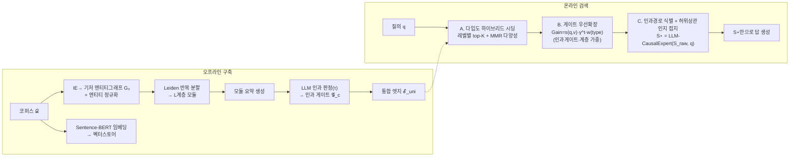
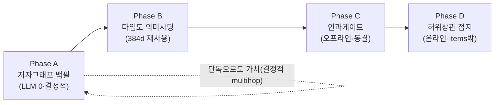

> ⚠️ 변경 금지 — 원본 immutable 보존 (Karpathy sources 계층). 요약본: [[10_Notes/2026-07-01_hugrag_pab_knowledge_graft]]

# HugRAG ↔ PAB 지식 기록 체계 비교 · 외부 brain 검색·추론 접목 검토

> **문서 성격**: 리서치 + 아키텍처 검토 — 외부 논문(HugRAG)을 PAB-v4의 지식 기록 3체계(LV0 obsidian-wiki / 미구현 MOC / v3 RAG)와 정면 비교하고, **외부에서 brain을 검색·추론할 때** 접목 가능한 지점을 레벨·단계별로 확정.
> **작성일**: 2026-07-01
> **분석 대상(논문)**: HugRAG: *Hierarchical Causal Knowledge Graph Design for RAG*, arXiv [2602.05143](https://arxiv.org/abs/2602.05143) v1 (2026-02-04)
> **분석 대상(PAB)**: `PAB-v3/` 실코드 · `backend/` LV0 실코드 · `PAB-obsidian/PAB-LLMDATA` 실 vault · `docs/overview/2604·2606·2607*` 설계문서
> **상위·연계**: [`260630-Khala플래너-LV0의미조회-설계.md`](./260630-Khala플래너-LV0의미조회-설계.md)(외부 자연어→플래너→결정적 LV0) · [`260629-PAB-v4-khala연동-아키텍처분석.md`](./260629-PAB-v4-khala연동-아키텍처분석.md)(조회/생성 두 축 분리) · [`260415-지식구조화-문서분할-방식-레퍼런스.md`](./260415-지식구조화-문서분할-방식-레퍼런스.md)(분할 6축)
> **한 줄 결론**: HugRAG의 3대 기법(계층 모듈 · 인과 게이트 · 허위상관 억제)은 PAB의 **비어 있는 상위 레이어(LV1~LV4·`knowledge_relations`·미구현 MOC)** 에 정확히 대응한다. 단, **LV0(결정적·저자작성)에는 절대 넣지 않고**, khala 플래너가 서는 **생성·라우팅축의 검색 백엔드**로 접목해야 결정성 SLA가 보존된다. 게다가 오프라인 파이프라인의 절반(청크+384d 벡터)은 **이미 LV0 인테이크가 만들고 있다**.

---

## 0. 요지

1. **HugRAG = GraphRAG의 다음 세대.** 지식그래프를 (a) **계층 모듈**(Leiden 분할 + 모듈 요약)로 쌓고, (b) 위상적으로 먼 모듈 사이에 **인과 게이트**(LLM이 인과성 판정)를 놓아 정보 고립을 깨며, (c) 온라인에서 **허위상관 인지 프롬프팅**으로 노이즈를 걸러 정밀도를 지킨다. 재현율↔정밀도 트레이드오프를 계층+인과로 동시에 푸는 것이 핵심.
2. **PAB의 세 체계는 각각 다른 축에 있다.** LV0 obsidian-wiki = *Wiki/Zettelkasten*(결정적·저자링크), 미구현 MOC = *Wiki 계층 인덱스*, v3 RAG = *기계·의미 청킹 + 벡터*(유사도만). **아무도 인과·계층·모듈을 갖고 있지 않다.**
3. **v3의 그래프는 "유사도"였지 "인과"가 아니었다.** `knowledge_relations`는 `auto_similar`(cosine≥0.85)·`follows/precedes`(순서)뿐 — HugRAG가 진단한 실패모드("표면 노드 매칭, 인과 부재")를 그대로 재현. multi-hop(depth 2)은 관계표가 비면 single-hop으로 퇴화.
4. **접목의 자리는 이미 설계로 정해져 있다.** khala 연동은 "**조회축(결정적 LV0)/생성축(LLM khala) 분리**"가 대원칙. HugRAG는 **생성·라우팅축**(khala 플래너의 검색 백엔드 = LV1~LV4)에만 들어간다. LV0 `items`는 여전히 저자 원문 **바이트 동일**.
5. **PAB만의 자산 — 저자 링크 = 공짜 인과 프라이어.** HugRAG는 인과 게이트를 LLM으로 *추론*하지만, PAB는 저자가 이미 그은 `[[링크]]`·`topics`·`type`이 있다. 이걸 **고신뢰 인과 게이트 시드**로 쓰면 순수-LLM HugRAG보다 정밀하고, 출처도 일부 보존된다.
6. **오프라인 파이프라인 절반은 이미 돈다.** LV0 인테이크가 문서를 `SemanticChunker`로 청킹하고 384d 벡터를 Qdrant에 적재 중(단지 LV0 API가 노출을 거부할 뿐). HugRAG 오프라인 1~2단계(IE·임베딩·벡터스토어) 입력이 이미 존재.

---

## 1. HugRAG 핵심 메커니즘

> 출처: arXiv 2602.05143 v1. 백본 LLM = `gpt-5-nano`(경량), 임베딩 = Sentence-BERT, 분할 = Leiden.

### 1.1 무엇을 고치나 — 기존 graph-RAG의 3대 실패

| 실패 | 내용 | 누가 앓나 |
|---|---|---|
| **전역 정보 고립(재현율 갭)** | 커뮤니티/패시지/의미 그룹핑이 오히려 경계를 강화 → 검색이 로컬 시드에 갇혀 위상적으로 먼 근거 v*를 놓침 | GraphRAG, LightRAG |
| **로컬 허위 노이즈(정밀도 갭)** | 인과 인식 없이 의미 근접+표면 순회 → 허위 노드·무관 노이즈가 정밀도를 깎음 | 대부분 |
| **QA 평가 편향** | 엔티티 "적중" 위주 벤치가 총체적 이해를 못 잡음 → 체계적 검색 실패가 가려짐 | 벤치마크 전반 |

### 1.2 계층 지식그래프 구조

- 계층 ℋ = {H₀, …, H_L}. **H₀** = IE로 뽑은 세립(細粒) 엔티티 노드(V₀). **H_ℓ>0** = Leiden 알고리즘 반복 분할로 만든 점점 굵은 **모듈** ℳ_ℓ.
- 각 모듈마다 **자연어 요약**을 생성 → 굵은 입도의 *의미 앵커*. (RAPTOR의 재귀 요약 트리와 유사하나, 여기선 그래프 모듈 단위)

### 1.3 인과 게이트 (핵심 혁신)

```
𝒢_c = { (m_i → m_j) | 𝕀_causal(m_i, m_j) = 1 }
```

- **𝕀_causal** = LLM 지시자 함수. 위상적으로 **먼** 모듈 쌍 (m_i, m_j)의 *요약*을 LLM에 주고 "이 둘 사이에 논리적/인과적 연결이 성립하는가"를 판정, 점수 ≥ 임계 τ면 게이트 부여.
- O(N²) 폭발은 **Top-Down 계층 프루닝**으로 완화.
- 게이트 = 검색공간의 **지름길** — 논리적으로 정당할 때만 단절된 모듈로 점프하게 허용 → *의미 표류 없이* 정보 고립을 깬다.
- 통합 엣지공간: **ℰ_uni = E_struc ∪ E_hier ∪ 𝒢_c** (구조 엣지 ∪ 계층 엣지 ∪ 인과 게이트).

### 1.4 오프라인 구축 / 온라인 검색



- **A. 다입도 하이브리드 시딩**: s(q,v) = 의미유사 + 어휘중첩 보간. 여러 계층 H_ℓ에서 top-K 시드, **MMR**로 중복 억제.
- **B. 게이트 우선 확장**: best-first, **Gain(v) = s(q,v)·γ^t·w(type(u,v))** (γ∈(0,1)로 장거리 감쇠, w는 **인과 게이트·계층 링크를 구조 엣지보다 우대**). 토큰예산/게인 임계에서 종료 → 노이즈 부분그래프 S_raw.
- **C. 인과경로 식별 + 허위상관 인지 접지**: S_raw를 표로 선형화 → **LLM-CausalExpert**가 유효 인과경로 부분집합 S⋆만 남김. "**허위상관 인지 프롬프팅**"으로 의미 유사가 유발하는 환각 링크에 저항. **S⋆에만 조건화**하여 답 생성.

### 1.5 결과·비용

- 벤치: MS MARCO·NQ·HotpotQA·2WikiMultiHop·QASC + **신규 HolisQA**(생물/CS/의학/경영/심리 — 총체적 이해 강조).
- 지표: F1 / Context Recall / Answer Relevancy. HugRAG가 LeanRAG·CausalRAG 등 graph-RAG 베이스라인을 다수 데이터셋에서 상회. HotpotQA F1 64.83(vs LeanRAG 48.68). 1.5M자 규모에서도 점수 유지(확장성).
- 비용: 인과 게이트 LLM 평가가 주비용(프루닝으로 완화), 백본은 경량 `gpt-5-nano`. 임계 τ는 튜닝 대상. LLM 인과 판정 품질에 의존(한계).

---

## 2. PAB 지식 기록 3체계 — 현황 (실코드 근거)

> **주의 — 두 개의 "레벨" 번호 체계가 공존한다** (혼동 1순위 함정).
> - **성장 스킴(2026-04, `260415-레벨업구조.md`)**: Brain 파이프라인 *완성 단계* Lv1~Lv4 (등록→구조→브레인→인격). **LV0 없음**(옵시디언 피벗 이전).
> - **신뢰 스킴(2026-06, `260627-LV0-조회API-명세.md`)**: 외부 노출용 *데이터 신뢰 계층* LV0~LV4. **LV0 = 옵시디언 인테이크**(신규 최하층). — 본 문서는 **신뢰 스킴(LV0~LV4)** 을 기준으로 쓴다.

### 2.1 LV0 obsidian-wiki — **구현됨** (분할축: Wiki/Zettelkasten)

- **인테이크**: `backend/services/obsidian/obsidian_intake_service.py` → `run_sync_pipeline()`. vault의 `10_Notes`·`15_Sources`·`20_Lessons`만 수집(화이트리스트). **`00_MOC/` 제외** ← 중요.
- **11필드 frontmatter**(`title·description·created·updated·type·index·topics·tags·keywords·sources·aliases`). `type`→7종·`index`→6도메인·`topics`→n개는 `[[ ]]` 위키링크. `Document.frontmatter_json`(JSONB) 저장.
- **위키링크 파서**(`backend/utils/wikilink.py`): 정규식만. `unwrap()`·`iter_wikilinks()`. 의미 해석 0.
- **Brain = 순수 수동 큐레이션 버킷**(`backend/models/brain.py`, `Brain`↔`BrainDocument` M:N, `UNIQUE(brain_id, document_id)`). 임베딩·라우팅·자동배정 없음. 옵시디언엔 존재하지 않는 PAB-네이티브 축.
- **외부 조회 API**: `/ext/lv0/v1` **8엔드포인트**(catalog·brains·brains/{id}·documents·documents/{id}·keywords·links·search). 봉투 상수 **`source="author"`·`confidence=1.0`** 하드코딩(`lv0_query_service.py:26`). 검색 = **부분문자열 매칭**(`text.lower().find`), 자기라벨 `"동의어·의미유사 미지원(→LV3)"`.
- **링크 = 저자 링크 + facet, 매 요청 실시간 계산(영속 0)**(`lv0_link_service.py:build_links`). `index/type/topics`→facet, `sources/[[..]]`→문서매칭 or `unresolved`. 인바운드 = 매번 역인덱스 재구축(결정적이나 O(N)).
- **결정성 계약**: 동일요청=바이트 동일. 임베딩·랭킹·LLM 0. **미해결 링크는 그대로 노출, 추측 0.** 상위레벨 키(`chunks`·`keywords_auto`·`semantic_links`)는 빈 배열로도 노출 금지(§명세).
- ⚠️ **"LV0에 청크 없음"은 API 표면 약속이지 저장 사실이 아니다.** 인테이크는 `ingest_note()`에서 `SemanticChunker`로 청킹하고 `KnowledgeChunk`(status=approved)·**384d 벡터를 Qdrant에 적재**하며 `map_labels()`로 라벨까지 만든다. LV0 API가 안 보여줄 뿐. → **HugRAG 오프라인 입력이 이미 존재.**

### 2.2 MOC / Wiki 레이어 — **미구현(PAB) / 옵시디언에 거주**

- **설계상 Wiki 레이어**(`260415-Wiki레이어-도입-파급분석.md`): 파싱↔청킹 사이에 `wiki_pages`(계층 섹션노드, `section_path="1/1.1/1.1.2"`)·`wiki_links`(단방향+역링크, dangling 허용) 삽입. → **백엔드 grep 결과 0건**(`wiki_pages`·`wiki_links`·`toc_entries`·`WikiPage` 전부 미존재). **설계 전용.**
- **PAB-측 자동 MOC(K-23~26**: 통합인덱스·cross-file 링크제안·엔티티 병합·충돌해소)**: 보류(Phase 2+)**. 이유(`260624-Brain-수동큐레이션-설계.md §1`): **옵시디언이 이미 MOC를 갖고 있어서** PAB가 재발명할 이유가 사라짐. 재개 시 방향은 "생성"이 아니라 "옵시디언 산출물에서 파생/읽기".
- **실제로 돌아가는 MOC = 옵시디언 쪽(사람이 작성)**: `00_MOC/{TYPES,DOMAINS,TOPICS}/` + dataview 라이브쿼리 + `moc-build` 정적 역링크 블록(`scripts/wiki/lib/moc.py`가 생성). DOMAIN(6) → TOPIC(n) → 타입드 노트의 **손으로 만든 2단 계층**. 노트는 `index`(도메인)·`topics`(주제)·`type`으로 분류링크, 본문은 `[[YYYY-MM-DD_slug|표시]]` 피벗 링크.
- **귀결**: `00_MOC/`가 인테이크 화이트리스트 밖 → **PAB LV0는 이 풍부한 MOC/역링크 계층을 아예 못 본다.** PAB는 리프 노트만 보고, 조회 시점에 얇은 링크 그래프를 재구성할 뿐.

### 2.3 PAB-v3 RAG — **레거시**(분할축: 기계·의미 청킹 + 벡터)

- **청킹**(`PAB-v3/backend/services/knowledge/chunking_service.py`): `SemanticChunker`, **1500자/200자 오버랩**(토큰 아님·문자), 마크다운 헤딩(`#{1,3}`) 분할 → 1500자 초과 시 단락 재분할 → 코드블록 보호. 프론트매터 파싱 없음(`f.read()` raw).
- **임베딩/벡터**: `paraphrase-multilingual-MiniLM-L12-v2` **384d**(한국어 포함), **Qdrant** 단일 컬렉션 `brain_documents`, **COSINE**. 페이로드는 `content[:500]`(500자 절단)만. (버그: `embedding_model` 필드에 문자열 `"int"` 저장; 컬렉션 startup 생성 없음)
- **검색 3종**: 의미(`query_points`, 페이지네이션 Python-side)·키워드(PG `tsvector('simple')` — **한국어 형태소분석 없음**)·하이브리드(**RRF k=60**, 가중 **0.7/0.3**). 리랭커 = CrossEncoder **`ms-marco`(영어 모델을 한국어에)**, AI답변 경로에서만 opt-in.
- **RAG 답변**: 기본 의미검색 top-k, `SIMILARITY_THRESHOLD=0.3`, 문서당 300자·컨텍스트 1000자·프롬프트 1600자로 **공격적 절단**. 생성 = 로컬 Ollama `qwen2.5:14b`. 환각 억제 = **프롬프트 지시 + 0.3 컷** 뿐(접지 점수화·인용 검증 없음).
- **Brain = 수동 문서 번들 + 스코프 필터.** 질의기반 라우팅 **없음**(`brain_scope_utils.resolve_scope_document_ids` = document_id 교집합). LLM 멀티브레인 라우터·Iterative RAG = **설계 전용**(`260320` 대화록).
- **관계/그래프**: `knowledge_relations`(`source_chunk_id·target_chunk_id·relation_type·confidence·confirmed·source`). 실제 채워지는 건 (1) **auto_similar**(Qdrant recommend, cosine≥0.85, **교차문서만**, 청크당 최대 5, **벌크 파이프라인에서만**), (2) 수동, (3) `follows/precedes`(인접 chunk_index, **제안만 하고 미영속**). **인과/is-a/part-of 의미 전무 — 유사도와 순서뿐.** multi-hop(`MULTIHOP_MAX_DEPTH=2`)은 이 희소 관계표에 전적 의존 → 비면 single-hop 퇴화.
- **명시된 한계**(`docs/context/02-*.md`): 지식그래프 ★★★☆☆(리팩터), **온톨로지·cross-brain 의미관계 없음**, 한국어 형태소검색 부재, 캐시 무효화 없음(stale), user_id 격리 미흡(교차사용자 유출·Critical), Ollama 동시성 병목.

---

## 3. 정면 비교

### 3.1 분할·구조화 6축(레퍼런스 문서) 위 위치

| 체계 | 주 분할축 | 계층 | 엣지(링크) | 엣지 의미 | 결정성 | 출처추적 |
|---|---|:--:|---|---|:--:|:--:|
| **LV0 obsidian-wiki** | Wiki/Zettelkasten(§2) | 손으로 `index→topics`(2단) | 저자 `[[ ]]`·facet | **연관(co-topic)** | **결정적** conf=1.0 | **강**(pab://lv0 URI) |
| **MOC(옵시디언)** | Wiki 계층 인덱스(§2) | DOMAIN→TOPIC(2단, 자동수집) | dataview+moc-build 역링크 | 분류·연관 | 결정적 | 강 |
| **v3 RAG** | 기계·의미 청킹+벡터(§1/§3) | 없음(평면 청크) | `knowledge_relations` | **유사도·순서** | 비결정(임베딩) | 약(청크 score) |
| **HugRAG** | KG/GraphRAG(§4)+RAPTOR트리(§2) | **자동 Leiden L단** | **ℰ_uni**(구조∪계층∪**인과게이트**) | **인과** | 비결정(LLM 구축) | 약(엔티티) |

### 3.2 능력 매트릭스

| 능력 | LV0 | MOC(옵) | v3 RAG | HugRAG |
|---|:--:|:--:|:--:|:--:|
| 동의어/의미 재현율 | ✗(부분문자열) | ✗ | △(임베딩) | **◎**(다입도 시딩) |
| 계층 입도(굵게↔가늘게) | △(도메인/타입) | ○(2단) | ✗ | **◎**(L단+요약) |
| 원거리 모듈 교차(정보고립 해소) | ✗ | ✗ | ✗(교차문서 유사만) | **◎**(인과 게이트) |
| 인과/논리 관계 | ✗ | ✗ | ✗ | **◎** |
| 허위상관 억제(정밀도) | N/A | N/A | △(0.3컷) | **◎**(허위인지 접지) |
| 결정성·재현성 | **◎** | ◎ | ✗ | ✗(동결로 완화) |
| 출처·인용 보존 | **◎** | ○ | △ | △ |
| 구축 비용 | 낮음 | 낮음 | 중 | **높음**(LLM O(N²)·프루닝) |

> **읽는 법**: 왼쪽 둘(LV0·MOC)은 **결정성·출처**가 강하지만 **재현율·인과**가 0. 오른쪽 둘(v3·HugRAG)은 그 반대. HugRAG는 v3가 "유사도"로만 갖던 그래프를 **계층+인과**로 끌어올린 것 — 즉 **PAB에 결여된 정확히 그 칸들**을 채운다.

### 3.3 한 장 통찰 — "인과 게이트 = 비어 있는 `knowledge_relations`"

```
v3가 채우려던 것:   auto_similar (cosine≥0.85, 교차문서, 유사도)   ← 표면 매칭, 인과 부재
HugRAG가 채우는 것: 𝒢_c (LLM 인과판정, 원거리 모듈, 인과)          ← HugRAG가 진단한 실패의 해법
LV0가 가진 것:      저자 [[링크]]·topics·type (사람이 그은 고신뢰 엣지)  ← 공짜 인과 프라이어
```

세 줄이 같은 테이블(`knowledge_relations`)의 과거·미래·자산이다. **v3의 실패 = HugRAG의 문제정의**이고, **LV0의 저자링크 = HugRAG가 LLM으로 추론하려는 것을 사람이 이미 만들어 둔 것**이다.

---

## 4. 접목 — 어디에, 어떻게

### 4.1 대원칙 — 결정성 경계(조회축/생성축)를 넘지 않는다

khala 연동의 확정 결정(`260629`·`260630`): **조회축**(결정적 LV0, `source=author`/`confidence=1.0`)과 **생성축**(LLM khala 추론)을 분리. Khala는 "**무엇을 조회할지만** 선택, 내용 생성 0"(§5 규약).

→ **HugRAG는 LLM-구축·LLM-접지라 본질적으로 비결정.** 따라서:

- ❌ **LV0에 넣지 않는다.** HugRAG 그래프를 LV0 응답에 섞으면 `confidence=1.0` SLA가 즉시 깨진다.
- ✅ **생성·라우팅축(LV1~LV4 = khala 플래너의 검색 백엔드)에 넣는다.** HugRAG는 *어떤 LV0 문서를 반환할지*를 더 잘 고르고, *추론 경로(인과 부분그래프)* 를 만든다. 반환되는 `items`는 **여전히 LV0 저자 원문 바이트 동일.**

```mermaid
flowchart TB
  EXT["외부 LLM / 사용자 (자연어)"]
  subgraph GEN["② 생성·라우팅축 — Khala 플래너 (여기 HugRAG 접목)"]
    HG["HugRAG 검색 백엔드<br/>계층모듈 → 인과게이트 확장 → 허위상관 접지<br/>= '어떤 LV0을 왜 고르나' + 인과경로"]
  end
  subgraph QRY["① 조회축 — PAB LV0 (불변·결정적)"]
    L0["/ext/lv0/v1/* 저자원문<br/>source=author · confidence=1.0 · pab://lv0"]
  end
  EXT --> HG
  HG -->|결정적 도구 호출로 원문 회수| L0
  L0 -->|원문 패스스루| HG
  HG --> OUT["plan(=인과경로) + items(LV0 원문) + lineage · synthesis=null"]
  OUT -.종합은 외부 LLM.-> EXT
  style GEN fill:#2a1e2a,stroke:#a78bfa
  style QRY fill:#1e3a2e,stroke:#22c55e
```



**핵심 재정의**: 현재 khala 플래너의 `plan`은 "호출한 도구 목록"(감사 메타)이다. HugRAG를 얹으면 **`plan`이 인과경로(S⋆)로 승격** — "이 문서들을 *왜·어떤 논리 연결로* 골랐나"를 담는 근거 부분그래프가 된다. 이는 §5 규약("plan은 답이 아니라 근거")과 정합하며, 오히려 근거를 강화한다.

### 4.2 오늘의 플래너 vs HugRAG 플래너

`260630` 부록 A(강남사옥 워크스루)가 오늘의 방식을 보여준다: 플래너가 **저자가 박아둔 `topics`(수평)×`type`(수직) 행렬**의 교차점으로 문서를 핀포인트. **저자가 전부 미리 구조화했을 때만** 성립하고, 동의어("지휘자↔오케스트레이터")·구조화 안 된 문서·저자가 링크 안 건 교차주제엔 실패(명세 §6.4).

| 국면 | 오늘(저자 facet ReAct) | HugRAG 접목 후 |
|---|---|---|
| 진입 시딩 | catalog→brain→`type×topics` 교차필터 | **다입도 하이브리드 시딩**(동의어·의미 재현율 확보, LV3 대체) |
| 확장 | 저자 `[[링크]]`만 추적(연관) | **인과 게이트 우선확장**(저자가 *안* 그은 원거리 모듈 교차) |
| 접지 | 없음(수집분 그대로) | **허위상관 인지 접지**(외부 LLM에 넘기기 전 노이즈 제거) |
| 근거 | plan=도구 목록 | plan=**인과경로 S⋆** |
| 결정성 | 결정적(저자 필드) | 비결정(LLM) — **동결+lineage로 완화** |

### 4.3 HugRAG 부품 → PAB 레벨 매핑

| HugRAG 부품 | PAB 대응(신뢰 스킴) | 현 상태 | 비고 |
|---|---|---|---|
| H₀ 기저 엔티티그래프 + 임베딩 | **LV1**(청크) + Qdrant 384d | **절반 존재**(인테이크가 이미 청킹·적재) | 노출만 막혀 있음 |
| 계층 모듈(Leiden) + 요약 | **미구현 MOC / LV1 wiki_pages** | 설계 전용(PAB) / 옵시디언에 수동판 | 옵시디언 DOMAIN/TOPIC = 수동 시드 |
| 인과 게이트 𝒢_c | **LV2 `knowledge_relations`(인과형)** | **비어 있음** | v3 auto_similar를 인과로 승격 |
| 다입도 하이브리드 시딩 | **LV3 의미검색** | 설계 전용 | 그래프 구조화된 LV3 |
| 모듈 요약 = 라우팅 앵커 | **LV4 라우팅힌트/brain 스코프** | Brain CRUD만 | 모듈 요약 → routing_hints |
| 허위상관 인지 접지 | (신규) 접지 필터 | 없음 | items 밖·선택 단계 |

→ **HugRAG는 사실상 PAB의 미구현 LV1~LV4 그래프를 짓는 구체 알고리즘**이며, 그 소비자는 외부 khala 추론 경로다.

---

## 5. 단계별 접목 로드맵 (결정성 보존 순서)

> 원칙: **결정적인 것부터**. LLM 비결정을 뒤로 미뤄, 각 단계가 독립적으로 가치를 내고 SLA를 안 깬다. ([[feedback_sequential_dev]] 준수)

### Phase A — 저자 그래프 백필 (LLM 0, 완전 결정적) ★ 최우선

- **무엇**: 옵시디언 MOC를 PAB 백엔드로 *읽어* 그래프화. 저자 `[[링크]]`·`topics`·`type`·`sources`·`index`를 노드/엣지로 `knowledge_relations`(또는 신규 `lv0_links` 테이블)에 **영속**. 인테이크 화이트리스트에 `00_MOC/` 파생 읽기 추가(§2.2 방향: "생성 아닌 파생").
- **왜**: 오늘 매 요청 O(N) 재계산하는 링크를 색인화 → 플래너가 **결정적 multi-hop** 가능(v3가 못 한 것). HugRAG의 *구조*(계층=DOMAIN/TOPIC, 엣지=저자링크)만 취하고 LLM 인과추론은 뺀 형태. **비결정 0, 출처 100%.**
- **DoD**: `/ext/lv0/v1/links`가 영속 그래프에서 응답, brain 스코프 N-hop이 저자링크만으로 결정적, 옵시디언 MOC의 DOMAIN/TOPIC이 PAB 모듈로 가시화.

### Phase B — 다입도 의미 시딩 (LV3 경량, 동결로 준결정적)

- **무엇**: **이미 적재된 384d 벡터**(§2.1) 위에 다입도 하이브리드 시딩(문서/청크/모듈 레벨 top-K + MMR)을 **플래너 도구**로 노출. HugRAG의 시딩 단계만 이식.
- **왜**: LV0의 치명적 공백(동의어·의미유사 미지원)을 **LV3 풀 재적재 없이** 메움 — `260630 §9`가 예고한 "LV3 경량 대안"의 실체. 인덱스 동결 시 동일 질의=동일 시드(준결정적), lineage로 추적.
- **DoD**: "지휘자"로 "오케스트레이터" 문서 회수, 시드가 pab://lv0 URI로 착지, LV0 결정 경로와 **분리 표기**(`source=ai_seed`, conf<1).

### Phase C — 인과 게이트 (LLM 오프라인, 동결·버전드)

- **무엇**: HugRAG 인과판정을 **오프라인**으로 실행해 원거리 모듈 간 인과 엣지를 `knowledge_relations`에 추가. **`relation_type="causal"`·`source="ai"`·`confidence<1`·버전 스냅샷.** 단, **저자링크(Phase A)를 고신뢰 프라이어로 우선**하고 LLM은 *빈 곳만* 추론(순수-HugRAG보다 정밀·저비용).
- **왜**: v3 `auto_similar`(유사도)를 **인과로 승격**, 정보 고립 해소. PAB의 저자링크 자산으로 O(N²) 후보를 크게 프루닝.
- **DoD**: 인과 엣지가 저자 엣지와 **레벨 태그로 구분**(LV0 vs LV2), 그래프 스냅샷 버전·lineage 기록, 재빌드 재현성(동결) 확보.

### Phase D — 허위상관 인지 접지 (온라인, items 밖)

- **무엇**: 외부 LLM에 넘기기 전, LLM-CausalExpert로 후보 부분그래프를 정제해 **어떤 LV0 문서를 반환할지 랭킹/선별** + 인과경로 생성. **핵심 제약: `items` 내용은 저자 원문 바이트 동일** — 접지는 *무엇을 고를지*와 *plan(경로)* 에만 관여, 원문 재서술 0(§5 규약 1·6 유지).
- **왜**: 정밀도·환각 억제(v3는 프롬프트+0.3컷뿐). "Khala는 선택만, 생성 안 함"을 그대로 지킴.
- **DoD**: 반환 items 전건 `source=author`·pab://lv0, plan=인과경로, 노이즈 문서 제외율 측정, synthesis=null 유지.



---

## 6. 리스크 · 유의

| # | 리스크 | 완화 |
|:--:|---|---|
| 1 | **결정성 오염** — HugRAG 엣지가 LV0 conf=1.0에 섞임 | 엄격 레벨 태깅(`source=ai`·conf<1), items는 저자원문만, 그래프는 별 테이블/버전 |
| 2 | **GPU mutex**(khala phase 6 기지 이슈) — 오프라인 빌드+온라인 접지가 khala vLLM과 GPU 경합 | 오프라인 빌드를 야간/배치, 온라인 접지는 선택적·경량 백본 |
| 3 | **재현 불가**(LLM 인과 게이트) | 그래프 **동결·버전 스냅샷**(임베딩 스냅샷처럼) + lineage. 재빌드는 명시 트리거 |
| 4 | **O(N²) 비용** | Top-Down 프루닝 + **저자링크 프라이어로 후보 축소**. 현 LV0 ~54문서는 사소, 성장 대비 |
| 5 | **한국어** | 임베딩은 이미 multilingual-MiniLM(한국어 OK). 인과판정 LLM = khala qwen(한국어 OK). v3의 영어 ms-marco 리랭커·`simple` tsvector 실수 반복 금지 |
| 6 | **레벨 번호 혼동**(성장 Lv1-4 vs 신뢰 LV0-4) | 문서·코드에서 신뢰 스킴(LV0-4)으로 통일, 성장 스킴은 UI 로드맵으로 격리 |
| 7 | **평가 편향**(HugRAG RQ2) — 엔티티 적중 벤치는 총체이해를 못 잡음 | PAB도 HolisQA식 총체이해 질의로 검증(강남사옥 같은 복합질의 세트) |

---

## 7. 결론 · 권고

1. **접목은 타당하고, 자리도 이미 비어 있다.** HugRAG의 계층 모듈·인과 게이트·허위상관 접지는 PAB의 미구현 LV1~LV4(특히 비어 있는 `knowledge_relations`와 옵시디언에만 있는 MOC)에 정확히 대응한다. 이는 신규 축이 아니라 **결여된 축을 채우는 것**이다.
2. **단, LV0는 신성불가침.** 결정성/출처 SLA는 PAB 외부공개의 핵심 가치다. HugRAG는 **생성·라우팅축(khala 플래너 검색 백엔드)** 에만 들어가고, 반환 `items`는 저자 원문 바이트 동일을 유지한다. 이 경계가 곧 `260629` 두 축 분리 원칙이다.
3. **PAB의 비교우위 — 저자링크 = 인과 프라이어.** 순수 HugRAG는 인과 게이트를 LLM으로 추론하지만 PAB엔 사람이 그은 고신뢰 엣지가 있다. 이를 시드로 쓰면 **더 정밀·더 싸고·일부 출처보존**되는 "HugRAG-lite"가 된다. 이것이 PAB만의 차별점.
4. **권고 착수 = Phase A(저자 그래프 백필).** LLM 0·완전 결정적이면서 즉시 가치(결정적 multi-hop, MOC 가시화)를 낸다. 이는 khala 플래너를 "저자가 다 구조화해야만 되는" 오늘에서 "구조화 공백도 메우는" 내일로 옮기는 **가장 안전한 첫 걸음**이며, Phase B~D(의미시딩→인과게이트→접지)의 토대가 된다.
5. **선행 의존**: 본 접목은 `/ext/lv0/v1`(STEP 0/1, 구현됨) + khala `pab_lv0_*` 도구 등록(`260630 §7`, 별도 레포) 위에 선다. Phase B는 이미 적재된 384d 벡터를 재사용하므로 LV3 풀 인프라를 기다리지 않는다.

---

## 부록 — 참고 자료

**논문**
- HugRAG: Hierarchical Causal Knowledge Graph Design for RAG — arXiv [2602.05143](https://arxiv.org/abs/2602.05143) ([abs](https://arxiv.org/abs/2602.05143v1) · [html](https://arxiv.org/html/2602.05143v1))

**PAB 설계(연계)**
- `260629-PAB-v4-khala연동-아키텍처분석.md` — 조회/생성 두 축 분리
- `260630-Khala플래너-LV0의미조회-설계.md` — 외부 자연어→플래너→결정적 LV0(부록 A 강남사옥 워크스루)
- `260627-PAB-v4-LV0-조회API-MCP-명세.md` — LV0 SLA·11필드·링크 5종
- `260415-지식구조화-문서분할-방식-레퍼런스.md` — 분할 6축(GraphRAG·RAPTOR·Wiki/Zettelkasten)
- `260415-Brain-Knowledge-개발방향-레벨업구조.md` — 성장 스킴 Lv1~Lv4
- `260415-PAB-v4-Wiki레이어-도입-파급분석.md` — wiki_pages/wiki_links 설계(미구현)
- `260624-LV0-Brain-수동큐레이션-설계.md` — Brain=수동큐레이션, K-23~26 보류

**코드(근거)**
- LV0: `backend/services/obsidian/obsidian_intake_service.py`, `backend/routers/external/lv0.py`(8엔드포인트), `backend/services/external/lv0_query_service.py`(:26 봉투상수)·`lv0_link_service.py`(:71 링크), `backend/models/brain.py`, `backend/utils/wikilink.py`
- v3 RAG: `PAB-v3/backend/services/knowledge/{chunking_service,auto_relation_service,chunk_sync_service}.py`, `PAB-v3/backend/services/search/{hybrid_search,reranker,multi_hop_rag}.py`
- MOC(옵시디언): `PAB-obsidian/PAB-LLMDATA/00_MOC/{TYPES,DOMAINS,TOPICS}`, `PAB-obsidian/scripts/wiki/lib/moc.py`

**메모리**: [[project_khala_pab_v4_integration]] · [[reference_pab_ecosystem_repos]] · [[feedback_sequential_dev]]

---

*본 검토는 "HugRAG를 PAB-v4 외부 brain 검색·추론에 접목한다면 어디에·어떻게"를 확정한다. 답: LV0는 건드리지 않고, khala 플래너의 검색 백엔드로 계층+인과 그래프를 얹되, 저자링크를 프라이어로 삼아 결정적 Phase A부터 단계적으로. 다음 행동은 Phase A(저자 그래프 백필) 상세 설계.*
